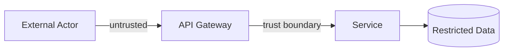

# Threat Model — {Feature / Service Name}

> **📋 Status**: draft | reviewed | frozen | superseded
> **🗓 Last updated**: YYYY-MM-DD
> **👤 Owner**: {Architect name}（與 arch failure-mode 盤點共用骨架）
> **🔖 Version**: v{n}
> **🔗 Related**: ADR-NNN · [`KB 04 Gate 4`](../04_freeze_gates.md) · [[06_quality_attributes_catalog]] §1/§5 · [[11_data_and_stack_catalog]] §1-§3

---

> [!NOTE]
> **條件式交付物。** 僅在觸發規則命中時為 Gate 4 必備 evidence（見 §Trigger）。STRIDE = 「惡意版 failure mode」，與 arch 的 failure-mode 盤點共用同一張表骨架，僅多 threat actor 欄。Security **達標常數**（auth method、CVE response time）留在 NFR matrix；本檔只盤點「誰會攻 / 攻哪 / 怎麼防」。

---

## 🚦 Trigger（為何此 feature 需要 threat model）

> 觸發規則（綁 [[11_data_and_stack_catalog]] §1 既有欄位，可機械判定）：
> ```
> threat_model_required =
>     (ERD.pii_type ∈ {identifier, sensitive})
>     OR (ERD.classification = restricted)
>     OR (surface ∈ {auth, payment})
>     OR (ERD.pii_type = quasi-identifier AND consent_required = explicit)
> ```
> Hard rule：命中卻無本檔、且無豁免 DR ⟹ **Gate 4 阻擋**。
> 既有 ERD 用 prose 標籤（特種個資 / PII / 脫敏）時，先經 [[11_data_and_stack_catalog]] §2.1 詞彙橋接正規化為 `pii_type` / `classification` 再評估。

| 命中條件 | 證據（哪個欄位 / surface） |
|:---|:---|
| {e.g. pii_type=identifier} | ERD `users.email` · [`docs/data/erd-{feature}.md`](../../docs/data/erd-{feature}.md) |
| {e.g. surface=auth} | {登入 / token 簽發 endpoint} |

**豁免（若主張不需要）**：寫 DR（rationale + 殘餘風險 + 到期 review 日）。簽核權：Architect 可簽、業主 informed。無 DR 即視為未滿足 Gate 4。

---

## 🗺 Scope & Trust Boundaries

- **In scope assets**: {要保護的資產 — PII 表、token、金流 endpoint}
- **C4 reference**: [`docs/architecture/c4-l2-{feature}.md`](../../docs/architecture/c4-l2-{feature}.md)



> 在圖上標出**信任邊界**（trust boundary）—— 每個跨邊界的 data flow 是 STRIDE 盤點對象。

---

## 🛡 STRIDE Threat Inventory

> 每個跨信任邊界的 element / data flow 逐一過 STRIDE 六類。每條 threat **必須**結到：(a) 一個 ADR mitigation decision、(b) API error model + status code + telemetry、(c) 一條 security negative test（寫進 system-spec acceptance）。未閉環的 threat 視為未 mitigate。

| ID | STRIDE | Threat actor | Asset / Entry point | 威脅描述 | Likelihood × Impact | Mitigation | ADR trace | API error / telemetry | Sec test |
|:---|:---|:---|:---|:---|:---:|:---|:---|:---|:---|
| TM-1 | **S**poofing | {匿名外部 / 內部越權} | {auth endpoint} | {偽造身分} | H×H | {mTLS / token 驗章} | ADR-NNN | 401 + `auth.fail` metric | TC-SEC-01 |
| TM-2 | **T**ampering | … | {write API} | {竄改 payload} | M×H | {idempotency key + 簽章} | ADR-NNN | 409 / 422 | TC-SEC-02 |
| TM-3 | **R**epudiation | … | {交易} | {否認操作} | M×M | {audit log + 不可否認簽章} | ADR-NNN | audit trail | TC-SEC-03 |
| TM-4 | **I**nfo Disclosure | … | {PII 讀取} | {越權讀取 / 過度回傳} | H×H | {欄位級授權 + 最小回傳} | ADR-NNN | 403 vs 404 策略 | TC-SEC-04 |
| TM-5 | **D**oS | … | {public endpoint} | {資源耗盡} | M×M | {rate limit + 429 + backpressure} | ADR-NNN | 429 + `ratelimit.hit` | TC-SEC-05 |
| TM-6 | **E**levation | … | {role 邊界} | {提權} | M×H | {RBAC 校驗 + deny by default} | ADR-NNN | 403 | TC-SEC-06 |

**STRIDE → error model 對照速記**：Spoofing→auth surface/401；Tampering→idempotency/409·422；Info Disclosure→403 vs 404 策略；DoS→rate limit/429；Elevation→RBAC/403。

---

## 📉 Residual & Accepted Risks

| ID | 殘餘風險 | 為何接受 | 接受者 | 到期 review |
|:---|:---|:---|:---|:---|
| RR-1 | {mitigation 後仍存在的風險} | {成本 / ROI / 低機率} | {Architect / 業主} | {date} |

---

## 📜 Compliance Map

| 法規 | 條文 | 本 feature 對應 |
|:---|:---|:---|
| GDPR | Art. 32 安全措施 | TM-1/TM-4 mitigation |
| GDPR | Art. 35 DPIA（sensitive / 大規模） | {是否需 DPIA} |
| 個資法 | 第 27 條 安全維護 | 對應 GDPR Art.32 |
| 個資法 | 特種個資第 6 條 | {若含健康 / 生物特徵} |

> 來源背書讓「跳過 threat model」在 audit 站不住腳（見 [[11_data_and_stack_catalog]] §3.2）。

---

## 🔗 Cross References

- **ERD（觸發來源）**: [`docs/data/erd-{feature}.md`](../../docs/data/erd-{feature}.md) data dictionary
- **System spec（abuse case ↔ UC alternative flow，security negative test）**: [`docs/analysis/system-spec-{feature}.md`](../../docs/analysis/system-spec-{feature}.md)
- **NFR matrix（security 達標常數）**: [`docs/architecture/c4-{feature}.md`](../../docs/architecture/c4-{feature}.md) §NFR
- **ADR（每條 mitigation 決策）**: `docs/architecture/adr/`

---

## ✍️ Sign-off

- [ ] **Architect** (owner): ____________ / Date: ____________
- [ ] **每條 STRIDE 已閉環**（ADR + error model + sec test 三連結齊）
- [ ] **Review verdict**（from `reviews/Gate4_NFR_ADR-{feature}-{date}.md`）: ✅ ready / ⚠️ revise / ❌ blocked

---

**End of Threat Model**

> 給業主：你主要看 §Trigger（為何需要）+ §Residual & Accepted Risks（你要不要接受殘餘風險）兩段。STRIDE inventory 是給 design / QA 的閉環來源。
